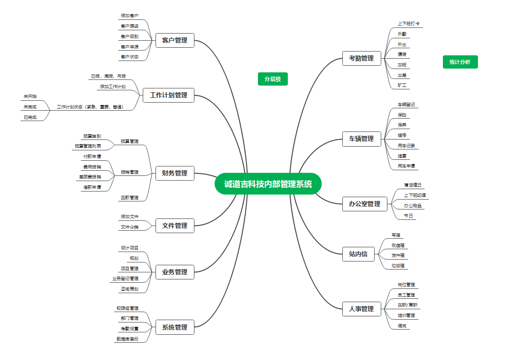

# 人事管理
## 员工管理
- 新增
点击新增按钮进行弹窗，在弹窗中输入员工的姓名、账号、电话、选择岗位、部门（岗位和部门是在系统配置中进行设置的）、密码、备注。新添加的员工默认是在职状态。
- 修改
可以修改用户的各种信息。
- 状态
可以修改用户的在职、离职状态
- 查看
可以查看员工的基本资料和工作中的各种活动。
- 列表
编号、姓名、电话、部门、岗位、状态、备注。
# 客户管理
- 列表
编号，客户姓名、联系方式、来源、跟进人、级别、状态、备注
- 新增
输入用户的基本信息，新增客户信息，谁新增的默认就是谁跟进。
- 修改
修改客户的基本信息。
- 指派
可以通过指派把客户分配给其他人跟进。
- 状态
可以设置用户的状态，有效无效。

# 车辆管理
## 车辆列表
- 列表
编号、车牌、颜色、品牌、型号、保险到期时间、状态（闲置、保养、维修、使用）、谁在用。
- 状态
可以修改车辆的状态
- 用车申请
用户可以点击申请，然后负责人审批
- 详情
点击详情可以查看车辆的详细信息，包括了用车记录、违章记录
- 新增
- 违章记录
可以添加违章记录
## 用车申请
- 列表
编号、车牌、颜色、品牌、型号、申请人、使用时间段
- 操作
同意、拒绝

# 系统配置
## 岗位配置
## 部门配置
## 权限配置
- 新增
新增各种权限组，在新增权限组的时候，需要选择对应的员工进入该组。一个人只能关联一个权限组。
- 查看
以列表的形式展示权限组和对应的用户。包括了编号、权限组名称、包含的用户、备注。
- 设置权限
对该权限组进行权限的分配。