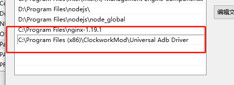
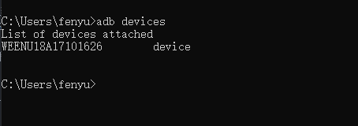
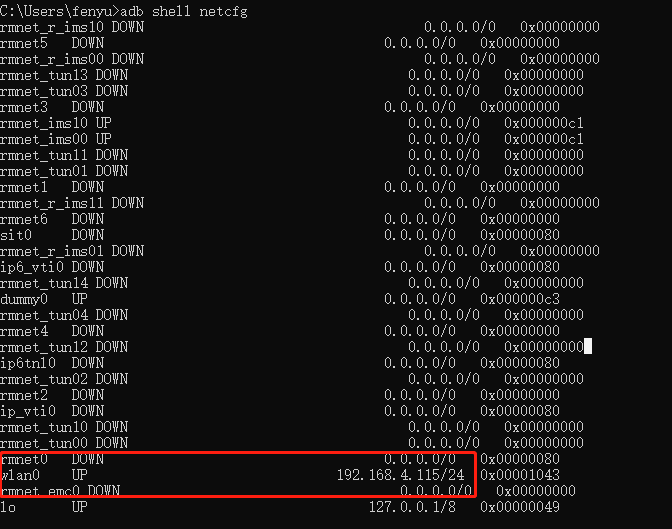
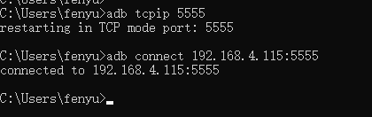
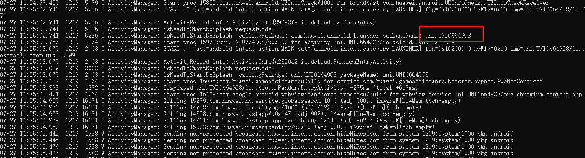
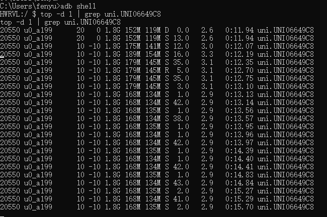

ADB是Android-Sdk里的一个客户端-服务器端程序，其中客户端是我们操作的电脑, 服务器端是Android设备，它的全称为Android Debug Bridge，就是起到调试桥的作用。通过这个桥我们可以管理设备或手机模拟器的状态，还可以进行很多手机操作，如安装软件、系统升级、运行shell命令等等。简而言之，ADB就是连接Android手机与PC端的桥梁，可以让用户在电脑上对手机进行全面的操作。
>详细说明：https://developer.android.google.cn/studio/command-line/adb
# adb的环境准备。
下载adb的安装包。
下载地址：https://adb.clockworkmod.com/
安装adb并配置环境变量
双击下载的安装包，安装成功后，讲路径添加到环境变量中。

配置号环境变量后，打开cmd，输入adb version检查adb是否安装成功。
# adb的连接
adb的连接有2种方式，第一种是有线连接，第二种是无线连接。
注意，不管是有线还是无线，都需要先打开手机的开发者模式，然后使用USB线，将手机和电脑连接。
- 有线连接
1、手机打开开发者模式。
在手机的系统设置中，点击关于手机，然后连续点击7次系统版本号，就可以打开开发者模式。
2、启用USB调试
进入开发者模式后，使用USB线将电脑和手机进行连接，然后在手机上勾选上USB调试选项。
注意：请设置手机息屏时间和在充电模式下进行USB调试。
3、检查是否连接成功。
打开cmd输入adb devices，检查是否出现设备名称。

如果出现设备名称，则连接成功。
如果没出现，请检查前面的步骤。
连接成功后，便可以做其他操作了。注意，必须一致保持手机和电脑的连接状态。（不能把USB线拔了）
- 无线连接
adb通过USB线连接成功后，则可以通过设置，把有线变成无线。
1、请保证手机和电脑处于同一个局域网。
2、查看手机局域网IP  adb shell netcfg

3、启动手机远程服务并连接
adb tcpip 端口号
adb connect ip:端口

4、检查是否连接成功

# adb常用命令
- 1）adb devices 查看当前连接电脑的设备，安卓设备或者模拟器会被显示出来
- 2）adb install 将指定的APK文件安装到设备上
- 3）adb uninstall 将指定的APP从设备上卸载
- 4）adb shell 通过上面的命令，就可以进入设备或模拟器的shell环境中，在这个Linux Shell中，你可以执行各种Linux的命令，另外如果只想执行一条shell命令，可以采用这种方式：adb shell ［command］，如：adb shell dmesg会打印出内核的调试信息
- 5) adb push 可以将电脑上的文件或者文件夹复制到手机设备上
- 6）adb pull 可以把手机设备上的文件或文件夹复制到本地电脑上
- 7）adb get-product 获取设备的ID号
- 8）adb get-serialno 获取设备的序列号
- 9）adb help 获取帮助信息

# ADB常用测试场景
## 获取包名
1、获取设备所有安装包：adb shell pm list packages （查看所有包）  | adb shell pm list package -3 （查看第三方的包）
2、获取要监控的APP的包名。adb logcat ActivityManager:I *:s
执行adb logcat ActivityManager:I *:s，然后在手机上操作要监控的包，通过日志找到包名。

## 资源监控
- 内存和CPU监控
top -d 1 | grep 包名

每列说明：
PID 进程id
USER 进程所有者的用户名
PR 优先级
NInice 值。负值表示高优先级，正值表示低优先级
VIRT 环境变更率
RES 进程使用的、未被换出的物理内存大小，单位kb。RES=CODE+DATA
SHR 共享内存大小，单位kb
D/R/S/T/Z 进程状态:D=不可中断的睡眠状态, R=运行, S=睡眠, T=跟踪/停止, Z=僵尸进程
%CPU 上次更新到现在的CPU时间占用百分比
%MEM 进程使用的物理内存百分比
TIME+ 进程使用的CPU时间总计，单位1/100秒

- 电量
adb shell dumpsys battery
- 流量

## 日志捕获
adb logcat > d:\info.txt
## 稳定性测试
https://www.jianshu.com/p/cb0cee9a22f1
https://www.cnblogs.com/yindada/p/9845032.html
对指定包进行随机测试并输出日志到文件
adb shell monkey -p com.zhihu.android  -vvv 200 > d:\info.txt

测试结果分析：

a、程序无响应，ANR问题：在日志中搜索“ANR”

b、崩溃问题：在日志中搜索“CRASH”

c、其他问题:在日志中搜索”Exception”

## dumpsys命令介绍
https://www.cnblogs.com/JianXu/p/5376642.html