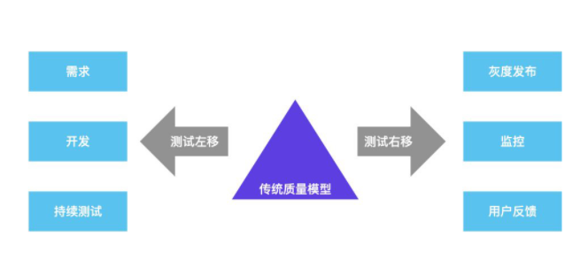
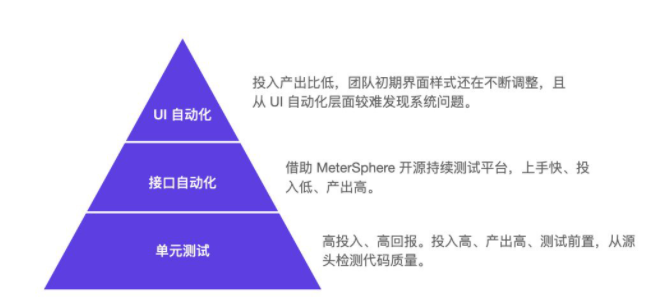

# 敏捷测试的流程和实施方案

## 目的
了解测试左移和测试右移的概念，让大家可以知道所谓的测试左移和测试右移是如何工作的。
在具体的项目中，如何灵活的将测试左移和测试右移和传统的测试模型结合起来。

宣传语：现在的测试工作，不懂敏捷测试怎么行?
本期萌芽重点在敏捷测试中的概念，方案和执行，以招商银行作为项目，分析软件行业现状。适应行业需求。在具体的项目中，灵活的将软件测试工作与敏捷开发相结合，力求达到质量和效率平衡的一系列测试实践。

## 第一天内容 传统测试模型的讲解
UI测试->接口测试->单元测试

现在的测试市场，50%的公司仍然采用传统的软件测试模型。
传统的测试模型重点在于关注常规意义上的测试内容，从单元测试、接口测试、UI测试从底向上的层层递进。虽然能够去保证软件的质量，但是随着目前敏捷流程的推行和IT行业对于效率的要求，已经不能满足大多数团队对于测试的要求了。

吹个比：学会敏捷测试，是现今测试面试的必备部分

## 第二天内容   测试工作和需求与开发的结合
在传统测试模型的基础上，测试人员通过对需求、开发、持续集成等环节的深度参与，可以进一步的加深对项目的参与度，进而提高测试的手段和效率。
不过在测试左移的过程中，也对测试人员的技能素质有了更进一步的要求。
需要测试人员对于需求设计、需求分析、需求管理、编程、数据库、持续集成、自动化、环境搭建都有了进一步的要求。

## 第三天内容   测试工作和用户反馈与线上监控的结合
仅仅是对测试左移的过程的参与，测试人员并不能及时的了解到线上的问题反馈，不能及时的去复现解决生产上遗漏的BUG的问题。
所以测试人员还需要对测试结束后的线上环境进行监控。
这就是所谓的测试右移，在测试右移的过程中，测试人员需求具备灰度发布、线上环境监控，用户反馈响应等能力。
也就是说，测试人员在测试右移的过程中，需求对运维、生产环境、运营的工作进行深度的合作和参与。

## 第四天内容 从面试角度 讲解敏捷测试的全程参与。
测试人员通过测试左移和测试右移的深度参与，全面的掌握项目产品从设计到研发到测试到发布到监控到用户反馈的一系列技能。全方位的对项目的质量进行把控和提升。加强了测试的业务能力，加快了项目的问题的反馈和解决速度。